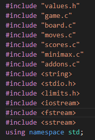
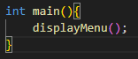
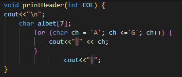
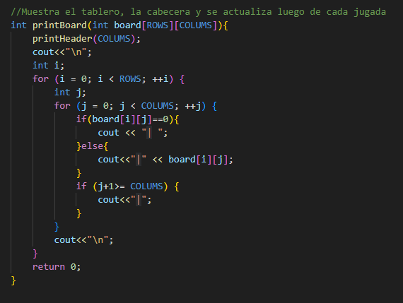
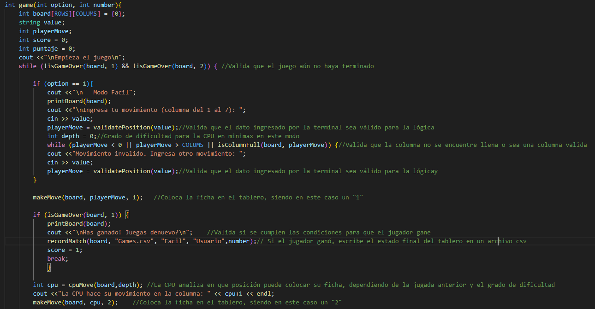

<!-- LOGO -->
 

    
 <!-- TITULO -->   
  

    Estructura de Datos Taller 2 - Anais Rodriguez
  

<!-- INDICE -->

  
Indice

  <ol>
    <li>
        <a href="#resumen-del-taller">Resumen del Taller</a>
      <ul>
          <li><a href="#consideraciones-extras">Consideraciones Extras</a></li>
      </ul>
    </li>
    <li>
        <a href="#librerías">Librerías</a>
    </li>
    <li>
        <a href="#código">Código</a>
        <ul>
          <li><a href="#main">main</a></li>
          <li><a href="#printheader">printHeader</a></li>
          <li><a href="#printbroad">printBroad</a></li>
          <li><a href="#game">game</a></li>
          <li><a href="#iscolumnfull">isColumnFull</a></li>
          <li><a href="#makemove">makeMove</a></li>
          <li><a href="#undomove">undoMove</a></li>
          <li><a href="#cpumove">cpuMove</a></li>
          <li><a href="#setlistproductiontoadd">setListProductionsToAdd</a></li>
          <li><a href="#setlistbrowsertoadd">setListBrowsersToAdd</a></li>
          <li><a href="#setlistsecuritiestoadd">setListSecuritiesToAdd</a></li>
          <li><a href="#setlistsocialstoadd">setListSocialsToAdd</a></li>
          <li><a href="#deletesoftware">deleteSoftware</a></li>
          <li><a href="#addsoftware">addSoftware</a></li>
      </ul>
    </li>
  </ol>

<!-- RESUMEN DEL TALLER -->
## Resumen del Taller
Se desarrolló el algoritmo para el juego Conecta 4 según los siguientes requerimiento:

* Se debe generar un menú para elegir la dificultad del juego (fácil, medio, difícil).
* Por consola se debe poder visualizar el estado de la partida en el momento (tablero de 6x7).
* Se debe generar un csv que guarde todas las partidas hasta el momento.
* se debe poder ver la puntuación de jugador vs máquina.
* Se debe poder guardar el estado de la partida,y después cargarlo al momento de iniciar el programa.

### Consideraciones Extras
* Se debe incluir en el algoritmo la lógica Minimax
* Se debe implementar PODA
* Se debe analizar el desempeño con y sin PODA

(<a href="#arriba">Ir a Inicio</a>)

# Librerías
Se están utilizando un total de 8 librerías, las cuales se muestran a continuación.

    
    
main.cpp

# Código
A continuación se detallan las funcionas usadas en la creación del taller.

## main
Función de tipo `int`, utilizada para mostrar el menú al usuario.
Permite seleccionar la dificultad del juego así como también regresar luego de cada partida para intentarlo nuevamente. 

    
    
main.cpp

(<a href="#arriba">Ir a Inicio</a>)

## printHeader
Función de tipo `void`, utilizada para mostrar en la interfaz del tablero el nombre de las columnas.
Las columnas están nombras desde la 'A' hasta la 'G' para que haya una diferencia notoria con el resto del tablero.

    
    
board.c

(<a href="#arriba">Ir a Inicio</a>)

## printBoard

Función de tipo `int`, utilizada para mostrar en la interfaz el tablero, el cual se va actualizando con cada jugada que se realizan.
Las dimensiones del tablero pueden ser modificadas en los parámetros del algoritmo. 

    
    
board.c

(<a href="#arriba">Ir a Inicio</a>)

## game

Función de tipo `int`, donde se invoca toda la lógica del juego: 

* Movimientos
* Puntuación
* Minimax y PODA

    
    
game.c

(<a href="#arriba">Ir a Inicio</a>)

## isColumnFull

Función de tipo `int`, utilizada para evaluar si la posición ingresada por ambos jugadores pertenece a una columna que se encuentra llena. 

    
    
moves.c

(<a href="#arriba">Ir a Inicio</a>)

## makeMove

Función de tipo `void`, utilizada para colocar en el tablero la ficha correspondiende a cada jugador dependiendo de la posición que ingresaron. 

    
    
moves.c

(<a href="#arriba">Ir a Inicio</a>)

## undoMove

Función de tipo `void`, utilizada para permitirle a la CPU modificar su jugada por una más conveniente según su constante evaluación de nodos. 

    
    
moves.cpp

(<a href="#arriba">Ir a Inicio</a>)

## cpuMove

Función de tipo `int`, utilizada para evaluar la jugada de la CPU aplicando Minimax y PODA.

    
    
moves4.cpp

(<a href="#arriba">Ir a Inicio</a>)

## isGameOver

Función de tipo `int`, utilizada para revisar el resultado del juego por cada jugador o si fue un empate. 

* Verificación de arriba a abajo
* Verififcación en diagonales
* Juego aún en cursp
* Empate

    
    
scores.c

(<a href="#arriba">Ir a Inicio</a>)

## minimax

Función de tipo `int`, utilizada por la CPU para la evaluación de nodos en función de Alpha y Beta, en base a los resultados toma el resultado que mejor le convenga.
Se incluye también la PODA para optimización análisis de nodos. 

    
    
minimax.c

(<a href="#arriba">Ir a Inicio</a>)

## evaluatePosition

Función de tipo `int`, utilizada por la CPU para la evaluación del estado del tablero, haciendo uso de puntajes para determinar que jugador está más cerca de ganar. 

    
    
minimax2.cpp

(<a href="#arriba">Ir a Inicio</a>)

###Valores definidos

Permite la modificación sobre el tamaño del tablero.

    
    
values.h

	

(<a href="#arriba">Ir a Inicio</a>)

## setListSocialsToAdd

Función de tipo `vector<Software*>`, utilizada para creación de objetos, relacionar la lista de amigos con el software y posteriormente agregar nuevos software sociales en un vector.

* social3: {nombre: "Facebook"; developer: "Meta Platforms, Inc."; clasificacionEdad: "18"; listaUsuarios: "listUsers"; precio: "0"; usuarios: "listfriends18"}.
* social4: {nombre: "Instagram"; developer: "Meta Platforms, Inc."; clasificacionEdad: "17"; listaUsuarios: "listUsers"; precio: "0"; usuarios: "listfriends"}.

    
    
main.cpp

(<a href="#arriba">Ir a Inicio</a>)

## deleteSoftware

Función de tipo `vector<Software*>`, utilizada para eliminar un software de la biblioteca, con la condición de que es necesaria la aprobación de todos los usuarios. 

    
    
main.cpp

(<a href="#arriba">Ir a Inicio</a>)

## addSoftware

Función de tipo `vector<Software*>`, utilizada para agregar un software de la biblioteca. 

    
    
main.cpp

(<a href="#arriba">Ir a Inicio</a>)

